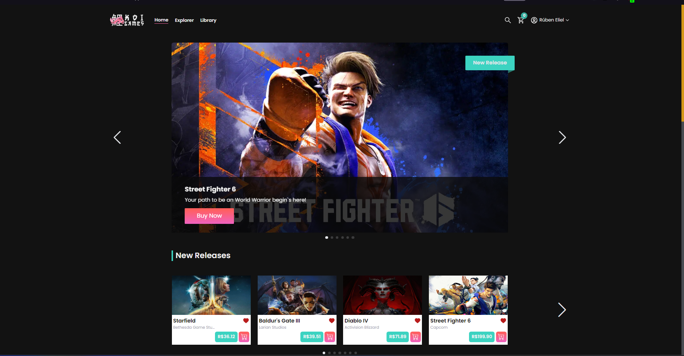

# 💻 KOI GAMES

<p>     O Koi Games E-commerce é um projeto full stack desenvolvido como parte de um estudo em desenvolvimento web, com o propósito de simular a experiência de compra de jogos em uma loja virtual profissional de forma simples e intuitiva.

O objetivo principal deste projeto é proporcionar aos usuários uma plataforma onde eles possam explorar uma variedade de jogos, pesquisar detalhes sobre cada jogo, fazer login ou se registrar como cliente, adicionar jogos ao carrinho de compras e, por fim, realizar compras de jogos em mídia virtual.

</p>

<h4 align="center">
	🚧  React JS  🚀 Em desenvolvimento...  🚧
</h4>

---

## 🎨 Preview

Você pode acessar o preview do projeto após o deploy clicando no link a seguir. Tenha em mente que o projeto está em constante desenvolvimento e diversas funções podem ter sido alteradas desde a última vez que você acessou o site.

### [](https://ecommerce-rubensouza.vercel.app)

<p>
Se você tentou acessar o projeto com o email acima e por algum motivo não funcionou, você pode rodar o projeto localmente seguindo os passos descritos logo abaixo.
</p>

---

## 🛠 Bibliotecas e Tecnologias

### Front-End

- React
- React-Icons
- Vite
- Javascript
- Typescript
- Redux
- Redux Toolkit
- Material UI
- Tailwind CSS
- Yarn - Package Manager
- Axios
- Hero Icons
- React Icons
- React Loading
- React Swiper
- React Router Dom
- Eslint
- Jwt
- Stripe

### Back End

- Axios
- Express
- Express-jwt
- Mongo DB
- Mongoose,
- Mongoose Aggregate Paginate

---

## 📦Pré-requisitos

Antes de iniciar o desenvolvimento, é necessário ter as seguintes ferramentas instaladas:

- Node.js
- NPM ou Yarn
- VSCode ou editor de códigos de sua preferência

---

## 🚀 Como executar o projeto

```bash

# Clone este repositório
$ git clone https://github.com/RubenSouza/Ecommerce.git

# Acesse a pasta do projeto no seu terminal/cmd
$ cd Ecommerce

#Acesse a pasta da Api/Back-end

$ cd api

# Instale as dependências
$ npm install || $ yarn install

#Execute o back end

$ npm run dev || $ yarn dev

# Em um novo terminal, acesse a pasta do Client/Front-End

$ cd client

# Instale as dependências
$ npm install || $ yarn install

#Execute o front end

$ npm run dev || $ yarn dev

```

---

## 🔒 Variáveis Locais

Após clonar o projeto, navegue até o arquivo env.example, renomeie para .env.local e adicione as chaves necessárias para utilização do projeto.

---

## 🦸 Autor

<a href="https://my-portfolio-rubensouza.vercel.app">
 
 <br />
 <sub><b>Rúben Eliel</b></sub></a> <a href="https://my-portfolio-rubensouza.vercel.app">🚀</a>

Feito com ❤️ por Rúben Eliel 👋🏽 Entre em contato!

[](https://www.linkedin.com/in/rúben-eliel-oliveira-souza-272b68159/)
[](mailto:rubem.eliel2012@gmail.com)

---

## 📝 Licença

Este projeto esta sobe a licença [MIT](./LICENSE).

Feito com ❤️ por Rúben Eliel 👋🏽 [Entre em contato!](https://www.linkedin.com/in/rúben-eliel-oliveira-souza-272b68159/)

---
